# 184 Final: Spheres & Physics in Minecraft

**Authors:** Isabella Alpert, Joel Castro, Jordan Duan & Robert Nochez  
**Project Webpage:** [Final Project Write-Up Webpage](https://jordan-duan.github.io/184-final/final-deliverable.html)  
**Slides:** [Google Slides](https://docs.google.com/presentation/d/1LGZGMx-Mz_L71ofXkpk-BMonL71gfiy98YgM6XWvmuM/edit?usp=sharing)  
**Video:** [Project Video](https://youtu.be/OcBq2-588C8)

---

## Abstract

In our final project, Spheres & Physics, but in Minecraft! We modded Minecraft to introduce two major enhancements: spheres that interacted with physics and custom shaders. The spheres feature realistic physics, particle effects, and sound effects. Moreover, we utilized unique textures, a custom blocky sphere model, and toggled custom properties to create a variety of spheres that exhibited distinct behaviors and properties. Additionally, we implemented custom shaders to alter the game's rendering style. When combined, our spheres and shaders add an interesting and dynamic layer on top of Minecraft.

---

## Technical Approach

### Spheres

Implementing a custom sphere entity in Minecraft required careful manipulation of the entity lifecycle and collision system. We created a new `SphereEntity` class that inherits from the Entity type in Minecraft, which allowed us to alter its default behavior. This was necessary in order to introduce a physics simulation, which includes kinematic behavior, modeling velocity, drag, gravity, collisions, and even rotational updates. To do so, we override as well as create new specific methods to get our defined behavior of a ball with realistic motion.

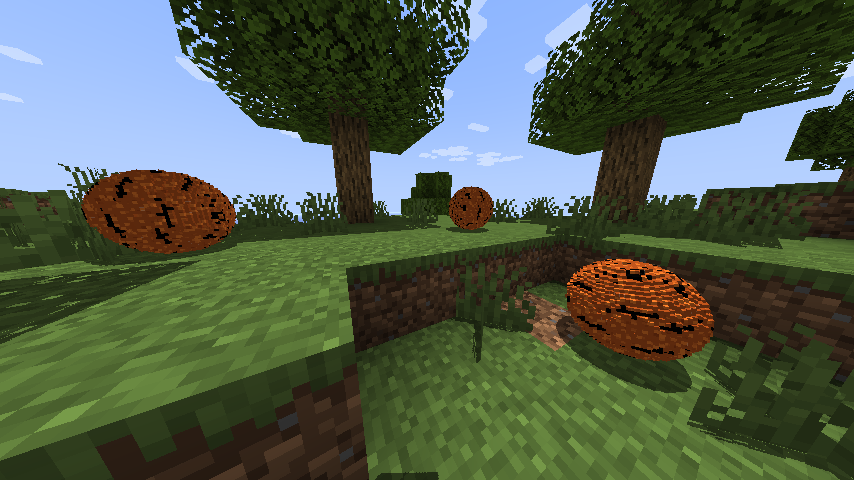

**Sphere Ticks:**  
At each tick of a sphere entity (16 ms), we check its current position and then simulate a gravitational pull and drag to stop the sphere if it is in motion by applying a velocity factor of 0.98 to its current velocity and as well as a small downward force of -0.04 to simulate gravity. These values were chosen from multiple tests, as larger and smaller values resulted in less smooth animations. We then deal with collisions by checking and resolving collisions with blocks, players, or other spheres, and depending on the type and strength of the collision, which will result in an updated velocity, and spawn particles and trigger a sound effect. We finally render the sphere appropriately with `updateRotation` to apply a rolling animation, simulating the sphere to rotate realistically as it moves.

**Collisions with Blocks:**  
We use a method, `handleBlockBounce`, to determine when a sphere collides with a block, if the collision should result in a bounce, how strong the bounce should be, and whether to play particle effects and a bounce sound effect. This begins by first getting the sphere's current velocity and initializing a boolean flag `hadSignificantBounce` to false, which will be used to track whether the bounce is strong enough to cue visual and audio feedback. The method then checks if the sphere has experienced a horizontal collision by calculating the bounceVelocity in the x and z direction by multiplying the preMoveVelocity with a bounce_elasticity. We also calculate the same with vertical collisions, only using the y direction and following the same procedure. If the bounceVelocity is more than our threshold defined by the Min_collision_velocity, the sphere is said to have bounced, so we set hadSignificantBounce to true, and it will cue particle effects as well as a sound effect to provide feedback that the sphere has bounced.

**Collision with Players:**  
To allow players to interact with spheres and kick them, we implemented a method, `pushAwayFrom`, to handle collisions caused by the player. When the sphere detects contact with another entity, it first checks if that entity is a PlayerEntity. If so, it calculates a direction vector `kickDir` pointing from the player to the sphere by subtracting the player's position from the sphere's and normalizing the result. To create a force between the sphere and player, we created an arbitrary constant `Player_kick_force` and multiplied it against the direction of the kick, and added it to the sphere's current velocity to create a new velocity vector. Similar to the collision with blocks, we then finally check to see if the newly made velocity caused by the player exceeds `min_collision_velocity` and causes the particle effects and sound effect to play if it does.

**Collision with Other Spheres:**  
To make our spheres a bit more interesting and allow for elastic collisions between two or more spheres, we used the `resolveSphereCollision` method. To first ensure that the spheres are indeed touching, we calculate a vector, `between`, that is calculated from the centers of the two spheres. This allows us to calculate when the spheres are touching without having to find a point of contact, which would require more resources and may even lag the system when more than two spheres are colliding. From this distance, we use a `minDist`, which is found by getting the radius of the two spheres and adding them together. If the spheres are touching, we compute the direction vector to identify how the spheres should be pushed apart and also calculate a correction value to resolve the intersection symmetrically (i.e., both spheres are affected by the elastic collision equally). We then calculate the relative velocity between the spheres based on their initial velocities and subtract them from each other, and calculate the impulse using an Elasticity constant set for each sphere entity. The final step is to then update each sphere's velocity based on this impulse and cause them to bounce off each other realistically, simulating an elastic collision.

**Rolling Animation:**  
To create the appropriate mesh rotation matrix for any given sphere translation, we utilized the Java `Quaternionf` that takes in an axisOfRotation and rotationAmount. The axis of rotation of a sphere is given by the cross product between the surface normal vector and the sphere's velocity vector: VxN. The velocity vector is an attribute of our SphereEntity class, and the surface normal was given by [0, 1, 0] in [X, Y, Z]. Moreover, the rotation amount was given by:  
`rotationAmount = (movementDistance / circumference) * 2𝜋`

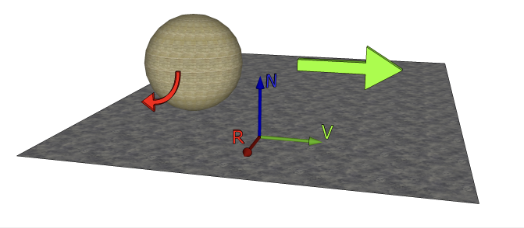

**Procedural Modeling Spheres:**  
Our sphere model is created in Java by sampling a unit sphere (defined by the formula x^2 + y^2 + z^2 = 1) along a discrete stepSize proportional to a specified cubeSize. Using Minecraft's built-in ModelPartBuilder, we can place blocks of size cubeSize at every sampled point to achieve virtually arbitrary sphere model resolutions (limited by performance), even in this limited blocky modeling environment.

---

### Shaders

Implementing custom shaders in Minecraft was challenging due to limited native support and sparse documentation. Most online resources assume the use of OptiFine or Iris, but we opted to work within the base Fabric environment to ensure compatibility with our voxel-based simulation. This meant re-implementing effects like Blinn-Phong, normal visualization, blur, and sharpening from scratch. Unlike reference OpenGL projects with full shader flexibility, Minecraft's engine restricted dynamic uniform control and runtime toggling, so we simplified our pipeline and leaned on the in-game settings menu to switch shaders rather than introducing GUI controls or extra mod dependencies.

| 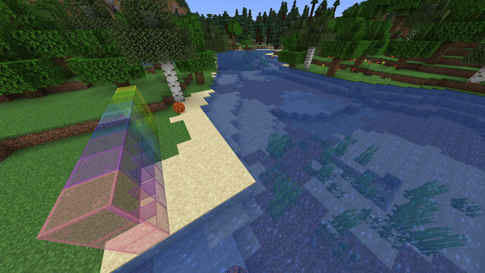 | 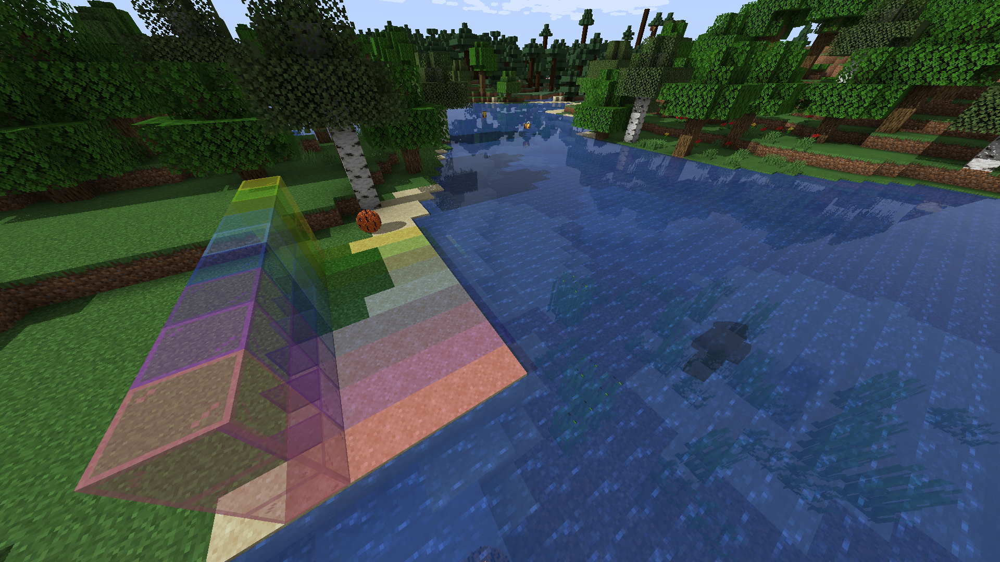 |
|:-------------------------------------:|:------------------------------------------:|
| No Shaders                            | Default Shader                             |

|  | 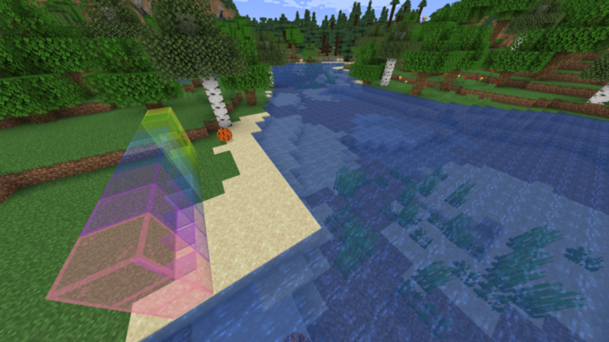 |
|:----------------------------------------------------:|:-------------------------------------:|
| Pixelization Shader                                  | Blur Shader                          |

| 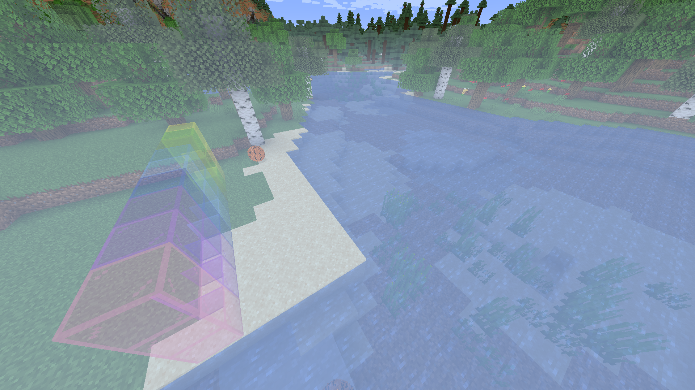 | 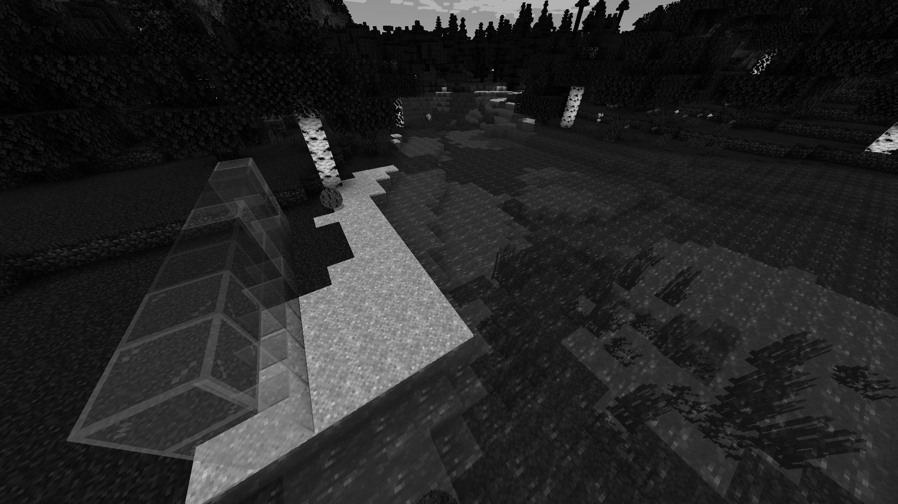 |
|:-----------------------------------:|:-----------------------------------------------:|
| Fog Shader                         | Grayscale Shader                               |

| 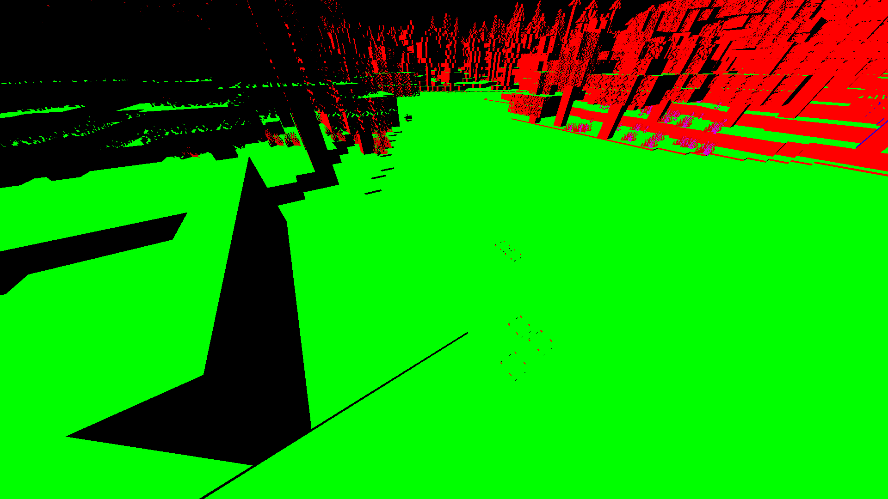 | 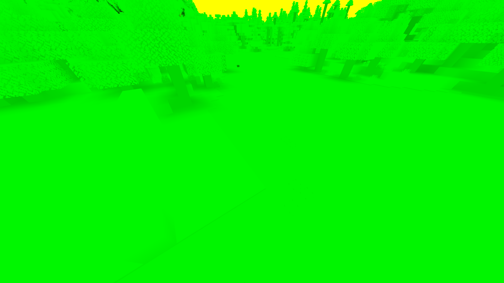 |
|:-----------------------------------------:|:------------------------------------------------:|
| Normal Shader                            | Sprite-Colored Shader                           |

**Default:**  
Our most dynamic shader that adds sky rendering with fog, stars, and clouds, shadow mapping with distortion, water rendering, physically-based rendering, reflection and ray marching, and deferred shading. We tried to implement a bidirectional reflectance distribution function that combines the specular and diffuse reflections using this formula of the Cook-Torrance model:  
`vec3 BRDF = (phongDiffuse + cookTorrance) * NdotL;`  
to get the diffuse reflection on Lambert's cosine law, and then we also determine shadow intensity by comparing the sun fragment depth and shadow map depth with simple math.

**Pixelization:**  
This shader applies a pixelization effect by downsampling the screen-space UV coordinates on the block into fixed grid size to reduce the resolution of the scene by sampling the texels in the grid pattern. The shader samples a single texel per grid cell and replicates its color across the cell, creating a retro, low-resolution aesthetic. This effect is achieved by manipulating the UV coordinates before sampling the texture. In the code, we grid sample by adjusting the texture coordinates to sample a single texel per grid cell, effectively  
`vec2 pixelCoord = floor(texCoord / pixelSize) * pixelSize;`

**Blur:**  
The blur shader applies a Gaussian blur effect to the screen by sampling neighboring pixels using a weighted kernel. It calculates the average color of nearby pixels based on their weights and outputs the blurred result. This shader is useful for creating soft-focus effects or smoothing textures. It also makes it look like you have cataracts. The math behind this is that the kernel is a 7x7 matrix that approximates Gaussian distribution with the weights, and the weights are skewed toward the center. Then with this code,  
`result += texture(gcolor, texCoord + offset).rgb * weight;`  
it loops over each fragment and computes the weighted sum of neighboring texels. We then get a normalized value by dividing by sum of weightSum and the output will be within [0,1].

**Fog:**  
The fog shader adds atmospheric fog to the scene based on the distance from the camera. It blends the scene's colors with a fog color, with the intensity determined by distance and height.  It uses exponential attenuation and height-based density modulation for realistic fog effects. The math behind the intensity is that it exponentially increases with distance, which is what fog does,  
`float fogAmount = 1.0 - exp(-distance * fogDensity);`  
and modules the fog intensity based on fragment height in  
`fogAmount *= smoothstep(20.0, -10.0, worldPos.y);`  
to emulate a field of vision when you're in fog.

**Grayscale:**  
The grayscale shader converts the scene's colors to grayscale by calculating the luminance of each pixel. It uses a weighted average of the red, green, and blue channels to determine the brightness. This shader is ideal for creating a monochromatic or desaturated visual style. It is also good for debugging. In this code,  
`float grayscale = dot(color.rgb, vec3(1.0 / 3.0));`  
we calculate the luminance through the weighted sum of RGB values.

**Normal:**  
This shader encodes surface normals into a normalized color space [0, 1], allowing easy visualization and debugging of geometry. Green areas represent normals along the positive Y-axis, red along X, and blue along Z; blended colors indicate intermediate directions. Technically, it transforms normals from view space to world space using the inverse model-view matrix and outputs them as RGB values in a texture. This is useful in deferred rendering pipelines or for verifying normal maps in lighting calculations. In the math behind it, we convert normals from view space to world space,  
`normal = mat3(gbufferModelViewInverse) * normal;`  
and maps the normal vector from [-1,1] to [0,1] to store in a texture in  
`encodedNormal = vec4(normal * 0.5 + 0.5, 1.0);`

**Sprite-Colored:**  
This shader shows how lighting values are stored within the lightmap, with red areas indicating only blocklight, green areas indicating only sunlight, and yellow areas indicating a combination of blocklight and sunlight. It outputs encoded normals and lightmap data to the G-buffer for integration into the deferred rendering pipeline. The math behind it is that it combines texture, vertex, and lightmap color contributions in  
`color = texture(gtexture, texcoord) * glcolor * texture(lightmap, lmcoord);`  
for color blending, and then we discard any fragments under a certain threshold of transparency.

---

## Problems We Encountered

Our initial design for the ball was a high-poly sphere produced in the Minecraft modeling platform, Blockbench. However, we soon realized that Minecraft restricts .obj to Block and Item classes. Unfortunately, the block class offered a less desirable starting point as it does not natively support attributes like 3D velocity. Ultimately, we found working with the Entity class too valuable and came up with our procedural block modeling instead. Additionally, at the very beginning, the sphere mod was built for Forge, another popular Minecraft mod loader, but we had to pivot to using Fabric in order to integrate with the shaders.

Originally, we planned to make a GUI or use keybinds with switch case functionality to toggle different shaders. Unfortunately, we learned that this is not implementable in native Minecraft and must be modded in. To maintain compatibility with the spheres and avoid potential issues from additional mods, we chose not to implement this feature, especially since shaders can be switched using the Settings menu.

One major challenge was rendering spheres: blocks don't support fragment-level shading, so we used entities to enable advanced lighting, which introduced complexity in positioning and performance. We also planned to add real-time shader toggles via GUI or keybinds, but Minecraft lacks a built-in way to switch shaders during runtime without heavy modding. To avoid introducing bugs or mod conflicts, we dropped that idea and stuck with manual toggling. Additionally, effects like volumetric fog and bump mapping were difficult to implement properly due to limitations in Minecraft's rendering pipeline, especially lacking depth access or post-processing flexibility. Another issue we ran into after implementation was performance issues. In one of our shaders, our FPS went from 130 to 9 fps, due to the high amounts of calculations our code was completing for light rays. Resources online were either behind a paywall, did not support our Fabric version, or did not have any relevant documentation / tutorials to follow.

---

## Lessons We Learned

We first tried to implement spheres as blocks rather than entities, as we initially thought that it would be a simpler approach within Minecraft's existing architecture. This approach started by extending the Block class and using a custom .obj model for the sphere, allowing us to easily place spheres on the world, stack them, and use them like any other building block. However, blocks in Minecraft are inherently static and grid-locked, meaning they can't interact with the environment as they “stick” to surrounding blocks. We were only limited to making our new sphere block into a type of FallingBlock, which gave it gravity-like behavior by allowing it to fall whenever it was unsupported (no block placed underneath it). After recognizing these constraints, we shifted to implementing spheres as entities that allowed for a far more dynamic behavior. This approach allowed spheres to be spawned into the world and move independently of the block grid. This gave us the freedom to experiment with animations and collisions, but these were often difficult to manage, given that heavy computational power was required, especially when using a much more detailed mesh, which also caused heavier animations to load. To solve these issues, we had to rely on iterative performance testing and even set up custom scenes with specific blocks to achieve the interactions and gameplay we wanted.

We learned that Minecraft's rendering model significantly differs from traditional OpenGL, requiring creative adaptation of standard shading techniques. Entity rendering proved essential for realistic lighting, as blocks are too limited for fragment-level effects. We also realized that minimizing feature creep—like dynamic shader switching—helped maintain project stability. Most importantly, debugging shaders in this environment was difficult without tools like RenderDoc, so we relied on careful visual feedback (e.g., using RGB encodings of normals) and iterative testing to verify our implementations.

---

## Results

After successfully integrating spheres and shaders, we were able to create several unique combinations for scenes and gameplay. The images below show some examples of this. Note that all of the gifs below that highlight the physics of our sphere are rendered with our default shader. For this project, we chose to use a basketball texture for our sphere. The gif below shows that the sphere is able to bounce up and down, similar to a basketball, when dropped.

The spheres are able to interact with the player, blocks, and other entities—including other spheres. When the ball collides with something, it has a particle effect and a sound effect that occurs.

Our spheres also have weight! In Minecraft, there is a pressure plate block that when stepped on by a player or an entity, can trigger a mechanism to occur. Our sphere is able to trigger the pressure plate, turning on a light, demonstrating that the sphere has weight.

Our spheres are also able to interact with different types of blocks. We found that the slime block had the most noticeable effect. The slime block is extremely sticky, slowing down the movement of entities when they walk on it. When the sphere moves across the slime block, its initial velocity from being kicked propels it forward. As it loses its momentum, it comes to an abrupt stop.

Next, we wanted to highlight each shader. Different shaders perform better or worse in different environments. Because of this, we chose environments that had the most interesting results. All gifs show the scene with and without the shader to create a point of reference.

|  |  |
|:-------------------------------------------:|:---------------------------------------------------:|
| Default Shader                              | Pixelization Shader                                 |

|  | 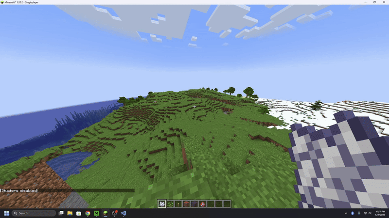 |
|:------------------------------------:|:--------------------------------------------------:|
| Blur Shader                          | Fog Shader in Overworld                            |

|  |  |
|:---------------------------------------------:|:----------------------------------------------:|
| Fog Shader in Nether                         | Grayscale Shader                              |

| 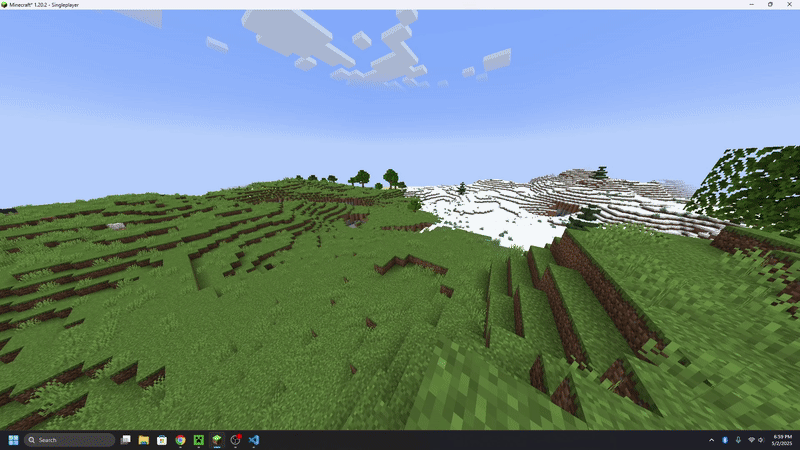 | 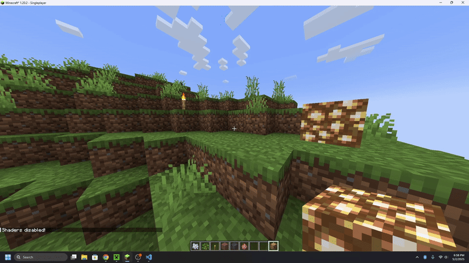 |
|:-----------------------------------------:|:------------------------------------------------:|
| Normal Shader                            | Sprite-Colored Shader                           |

---

## References

- Iris Docs (Shaders Documentation): https://shaders.properties/
- Fabric Modding Developer Documentation: https://docs.fabricmc.net/develop/
- Template Used to Create Sphere Mod Structure: https://fabricmc.net/develop/template/
- Minecraft Entity Methods: https://learn.microsoft.com/en-us/minecraft/creator/scriptapi/minecraft/server/entity?view=minecraft-bedrock-stable
- OpenGL Lighting and Shading Techniques: https://learnopengl.com/Advanced-Lighting/Advanced-Lighting
- Shader Tutorial Video: https://www.youtube.com/watch?v=RjyNVmsTBmA&ab_channel=SamuelGerkin

---

## Contributions From Each Team Member

- **Jordan:** Developed the default, pixelization, blur, & fog shaders. Wrote the majority of the proposal write up and slides. Wrote the final deliverable.
- **Isabella:** Developed grayscale, normal, sprite-colored, & fog shaders. Wrote the majority of the milestone and slides. Wrote the final deliverable.
- **Joel:** Sphere model generation scripting, texturing, and rotation mechanics. Edited the final video. Wrote the final deliverable.
- **Robert:** Implemented sphere physics with collisions for blocks, players, and other spheres. Set up sphere class. Created final video outline. Wrote the final deliverable.

---

## CurseForge Download Page(s)

[Main CurseForge Page](<https://www.curseforge.com/minecraft/mc-mods/spheres-physics>)

[Shaders CurseForge Page](<https://www.curseforge.com/minecraft/shaders/spheres-physics-shaders>)

---

> For more details, see the [full project write-up](https://jordan-duan.github.io/184-final/final-deliverable.html) or the [video presentation](https://youtu.be/OcBq2-588C8).
